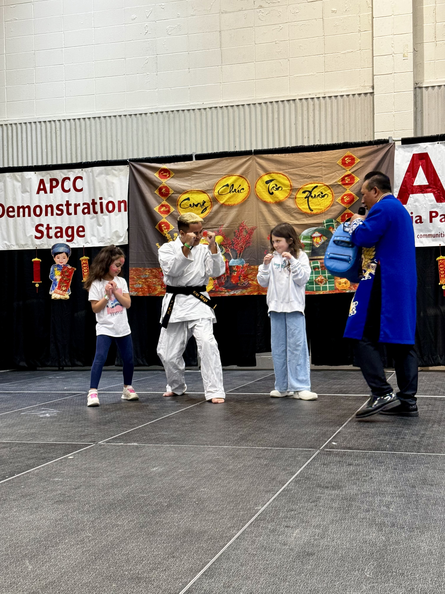

# **Sho Dan Sensi**: Second Segree Black Belt

Welcome to my GitHub Pages site where I share my passion for Isshinryu Karate!

## Summary
Isshinryu Karate is a traditional Okinawan martial art known for its **practical self-defense techniques**, **emphasis on simplicity and effectiveness**, and **focus on developing both physical and mental strength**.

## Why I Love Isshinryu Karate
1. <u>Self-Defense Skills</u>: Isshinryu Karate provides practical self-defense techniques that can be applied in real-life situations, empowering practitioners to protect themselves and others.
2. <u>Physical Fitness</u>: Training in Isshinryu Karate improves strength, flexibility, balance, and endurance. It offers a full-body workout that enhances overall fitness and well-being.
3. <u>Discipline and Focus</u>: Practicing Isshinryu Karate cultivates discipline, mental focus, and concentration. It teaches respect for oneself and others, as well as perseverance in the face of challenges.

